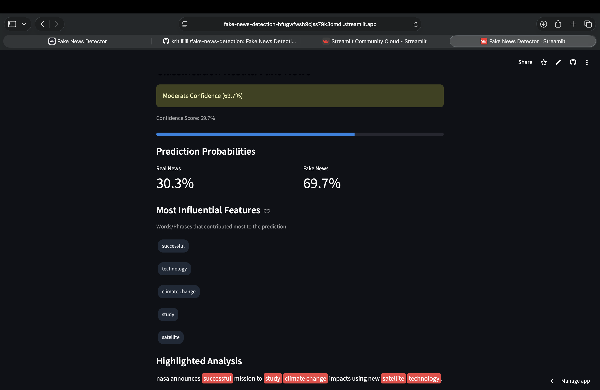
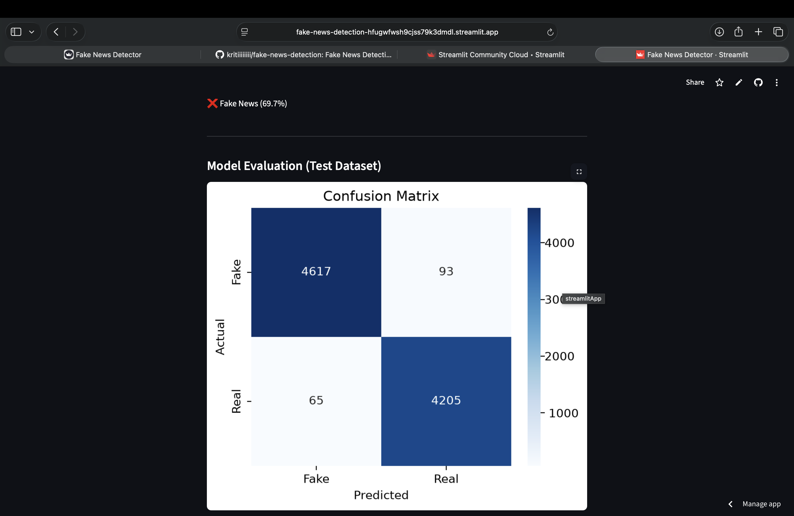

## Fake News Detection System

A Machine Learning-powered Fake News Detection application that classifies news articles as Real or Fake using Natural Language Processing (NLP), TF-IDF Vectorization, and Logistic Regression.

## Live Demo

🚀 Try the deployed application:
https://fake-news-detection-hfugwfwsh9cjss79k3dmdl.streamlit.app

## Screenshots

### Home Page


### Prediction Result


### Detailed Analysis



### Model Evaluation



## Features

* Real-time fake news prediction
* Text preprocessing and cleaning
* TF-IDF feature extraction
* Machine Learning classification
* Confidence score generation
* Interactive Streamlit web interface
* Visualization of influential keywords

## Tech Stack

* Python
* Pandas
* NumPy
* Scikit-learn
* NLTK
* Streamlit
* Matplotlib
* Seaborn
* Plotly

## Project Structure

```text
fake-news-detection/
│
├── app/
│   └── app.py
│
├── src/
│   ├── preprocess.py
│   ├── vectorizer.py
│   ├── train.py
│   ├── predict.py
│   └── evaluate.py
│
├── models/
│   ├── model.pkl
│   ├── vectorizer.pkl
│   └── metrics.pkl
│
├── notebooks/
│   └── EDA.ipynb
│
├── screenshots/
│   ├── home.png
│   ├── prediction-result.png
│   ├── analysis.png
│   └── confusion-matrix.png
│
├── requirements.txt
├── README.md
└── .gitignore
```

## How to Run
Clone Repository

git clone https://github.com/kritiiiiiiii/fake-news-detection.git

Navigate to Project Directory

cd fake-news-detection

Install Dependencies

pip install -r requirements.txt

Run Streamlit Application

streamlit run app/app.py

## Model Performance

Logistic Regression Accuracy: 98.24%
Naive Bayes Accuracy: 94.67%

The Logistic Regression model was selected as the final model due to its superior performance.

## Dataset

The original dataset and trained model files are not included in this repository because of GitHub file-size limitations.

Author

Kriti Jha
